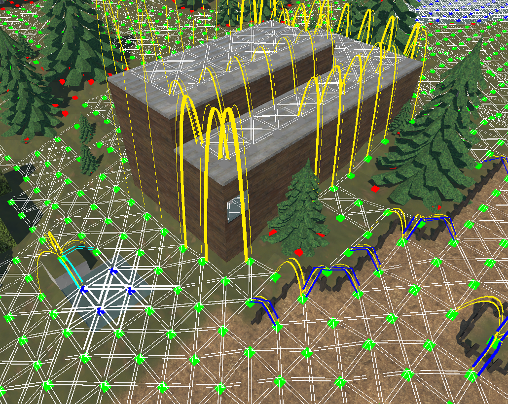

# About
BlockMaps is a Unity framework for building grid-based 3D worlds with integrated real-time navmesh generation for complex movement, actor-based vision system, and pathfinding.

  
_Example of a world built with the framework_
 

# Framework Features
The frameworks purpose is to be able to create worlds, and also defining attributes and behavioural rules of anything that can exist in that world. This should allow the framework to be useful for many different purposes.

## Main World Elements
BlockMaps worlds are composed of three primary elements: Nodes, Walls, and Entities. These components form the basis of all other systems.

### Nodes
Nodes are the places where things exist. A node exists in one 2d-grid-cell and can have differing altitudes in each of its 4 corners. Multiple nodes can exist in the same 2d-grid-cell, allowing for 3-dimenstional worlds.
Nodes provide the foundation for the navmesh, movement and pathfinding, since entities will be placed on them and move between them.
Each node has a surface, which will defines how the node behaves and interacts with other systems.

Each 2d-grid-cell contains exactly one ground node, making up the terrain and lowest layer of nodes. The terrain layer of nodes will also automatically create cliffs between adjacent nodes of different altitudes.
Any amount of nodes can exist above the ground/terrain layer.

### Walls and Fences
Walls exist in cells on the 3d-grid an are placed on a specific side or corner within a cell. They are not directly related to nodes and exist independetly of them.
Fences are a very similar object type to walls in the sense that they also exist on cell edges, but in contrast to walls they are bound to specific nodes and adjust to that node's shape.
Walls and fences directly affect the navmesh, pathfinding and vision system.
Walls and fences can also be climbed and/or vaulted over by entities, depending on the attributes of both.

### Entities
Entities are all things that exist in the world, from static props like rocks and trees to dynamic agents like characters or interactive objects like doors and ladders.

Entity blueprints (which define how an entity looks, behaves and interacts with various systems) are highly customizable. Things like how it's rendered (premade model, procedurally generated, texture variants) to it's exact shape of how it affects the navmesh and pathfinding (fully blocking, slowing down, decoration only), to how it interacts with the vision system (opaque, transparent), can all be easily defined in the blueprint.

Entities can additionally contain pre-built or custom systems like movement, skills, stats and modifiers that can be added through a modular component system. Components allow to easily extend the behaviour or capabilities in a specific way. Custom components and entities can be created as well.
The skill, stat and modifier components are already set up in a way that they can natively interact with each other. They can all be created in a project-specific way (just like all other content blueprints as well).

## Content Blueprints / Defs
The exact attributes, look and behaviour of the individual elements mentioned are highly customizable with a system that allows to easily create and alter content blueprints (aka Defs), which can then be used in the world.
The framework also comes with a collection of tile types, wall types, objects, characters and world generators to get started easily.
For people familiar with the RimWorld codebase, the system is highly inspired from Verse Defs.

Each of these "content blueprints" contains lots of attributes that can be mixed and matched to create highly detailed and specialized behaviours.
For example each surface can define its own rules on if/how fast entities move on it, how tiles with the surface are rendered.
This system then interacts with the blueprints of entities, which define the rules on if/how the entities can move (walking, swimming, climping, vaulting), how far they can see, how big they are, how they affect other entities' vision, if they can be picked up and much more. The way entities are rendered in the world is also customizable, ranging from basic things like their model, materials and texture variants, to things like what materials should be colored according the owning players colors and how it should be placed in varying elevation.
Similary blueprints for walls and fences, that exist on the egde of grid cells, can be created as well.

## Navmesh, Pathfinding and Movement
The navmesh will be generated during world initialization based on all nodes, walls, fences and entities and can then be updated anytime at runtime. For small areas this is very performant and can always be done if an element (i.e. surface, wall, entity) that affects the navmesh changes.

The framework comes with a custom implementation of the A* algorithm that is used for pathfinding. Pathfinding is entity-specific and takes into account an entity's specific movement attributes and skills.
When searching for paths, various options can be configures like forbidden zones, or the vision system (i.e. only take into account explored nodes).

  
_Navmesh preview in the world editor showing different kinds of transitions (walk, climb, hop, swim)_
 

## Actors and Vision
Each world has a specific set of Actors, always including a netural actor called Gaia. Each entity belongs to a specific actor and each actor has its own vision state of the world.

Each world element exist in one of three visibility states for each actor: Visible, Explored, Unexplored.
Visible elements are those that entities of an actor currently see. Explored elements are those that have once been seen but not anymore (aka fog of war). And unexplored elements have never been seen.
Each entity has its own attributes on if/how far it sees and how it affects the vision of other entities.

The vision works with rays, which are sent out from non-blind entities to everything within their vision range. This means walls, rocks, terrain etc. will believably block the vision and entities will not just see through things and only provide vision to things that can actually be seen from their point of view.

The framework also stores the last known position for each entity for each actor.

## Game Loop
Additional to the standard game update loop that gets called every frame, the framework provides an additional tick-loop that runs at a fixed 60 ticks per seconds (TPS).
This loop should be used for everything simulation-related and be responsible for setting and handling all states.
The conventional per-frame update loop should only be used for handling inputs and rendering.

## Chunks, Performance and Limits
Each world is split up into chunks, made up out of 16x16 nodes each horizontally and the full world height vertically.

All rendering is handled on a chunk-to-chunk basis. Nodes, fences, walls and entities (if so configured) are combined into a single GameObject and mesh per altitude layer per chunk.
Recalculating of world systems (rerendering chunks, recalculating navmesh, recalculating vision) can and should always be done locally for only the affected area and performance of that is therefore not affected by world size.

The main performance bottleneck for big worlds is mainly the duration it takes for the initial calculations when loading a world the first time (especially navmesh generation).
Once initialized, performance should be acceptable for worlds up to 32x32 chunks.
The vision system can tank performance as well if there are many entities with vision moving around on the map.

# Repository Content
The repository currently contains 3 main projects, that are all within the same unity project:
* Blockmap Framework: The framework containing all the core systems and functionality.
* World Editor: An editor where you can generate, build, alter and test worlds using the framework, giving you full freedom to test out all the systems and to showcase how they perform at runtime.
* Capture The Flag: A game using the framework to showcase what is possible with it.

# World Editor
The world editor provides a lot of functionality to generate, build, change, save and test own worlds. All systems are updated at realtime whenever a change is made to the world.
The editor contains a big amount of tools which allow you to:
* Generating worlds using pre-exising world generators
* Saving and loading worlds
* Adding new nodes
* Changing node surfaces
* Altering the world terrain
* Placing a variety of entities
* Placing water bodies
* Placing objects with special behaviour such as ladders and doors
* Building fences, walls, windows, floors, roofs, bridges in a modular way
* Placing and moving around different entity
* Adding and dropping entities to/from another entity's inventory
* See the world from different actors perspectives
* See the world in different styles (flat-shaded or textured, with/without grid, with/without texture blending)
* See and inspect the generated navmesh

 

# Capture The Flag
Capture The Flag is a 1v1 turn-based squad tactics game based on the classic outdoor game with the same name. It makes use of the pathfinding, vision and movement system of the framework and is a good showcase of what's possible with it.

The gameplay is very simple. Two teams of 8 characters each face off on a random, procedurally generated, unexplored map. The goal is to move a character onto the enemy flag bevor they move one on your flag. If a character gets tagged by one of the other team in their territory they are sent to jail for a few turns and can't move. Teams consist of different characters (humans and dogs) with different skills (running, vision, endurance, regeneration, swimming, climbing, vaulting).

Each turn every character gets 10 action points. In multiplayer turns are simultaneous and players can move their characters at the same time. Moving and actions cost action points based on the characters skills. Each spent action point also spends the same amount of stamina. Characters have 50-100 stamina, but it doesn't regenerate fully like action points.

The game supports singleplayer and P2P-multiplayer.

  
_In-Game screenshot of a Capture the Flag match_
 

