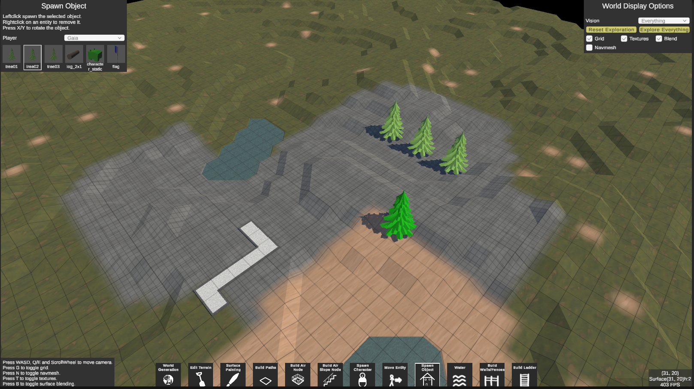
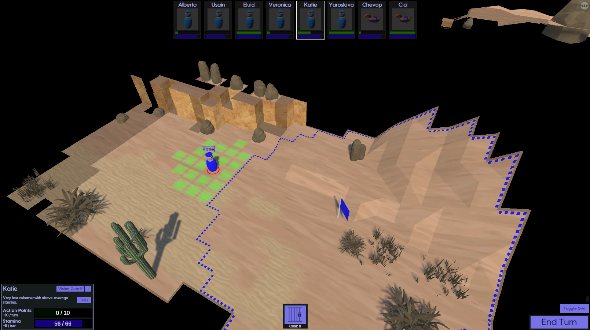

# About
BlockMaps is a Unity framework to create detailed, fully 3-dimensional tiled maps with integrated performant systems like pathfinding, vision, advanced movement (such as swimming, climbing, jumping). Everything is built in a modular way so that all interactions between the different systems should inherently work.

The repository currently contains 3 main projects, that are all within the same unity project:
* Blockmap Framework: The framework containing all the core systems and functionality.
* World Editor: An editor where you can generate, build, alter and test worlds using the framework, giving you full freedom to test out all the systems and to showcase how they perform at runtime.
* Capture The Flag: A game using the framework to showcase what is possible with it.

# World Editor
The world editor provides a lot of functionality to generate, build, change, save and test own worlds. All systems are updated at realtime whenever a change is made to the world.
The editor contains a big amount of tools which allow you to:
* Generating worlds using pre-exising world generators
* Saving and loading worlds
* Altering the world terrain
* Placing a variety of entities
* Placing water bodies
* Placing objects with special behaviour such as ladders and doors
* Building fences, walls, windows, floors, roofs, bridges in an unrestricted, modular way
* Placing and moving around different characters
* See the world from different players perspectives
* See the world in different styles (flat-shaded or textured, with/without grid, with/without texture blending)
* See and inspect the generated navmesh

 

  

# Capture The Flag
Capture The Flag is a 1v1 turn-based squad tactics game based on the classic outdoor game with the same name. It makes use of the pathfinding, vision and movement system of the framework and is a good showcase of what's possible with it.

The gameplay is very simple. Two teams of 8 charaters each face off on a random, unexplored map. The goal is to move a character onto the enemy flag bevor they move one on your flag. If a character gets tagged by one of the other team they are sent to jail for a few turns and can't move. Teams consist of different characters with different attributes.

The game supports singleplayer and P2P-multiplayer.

  

