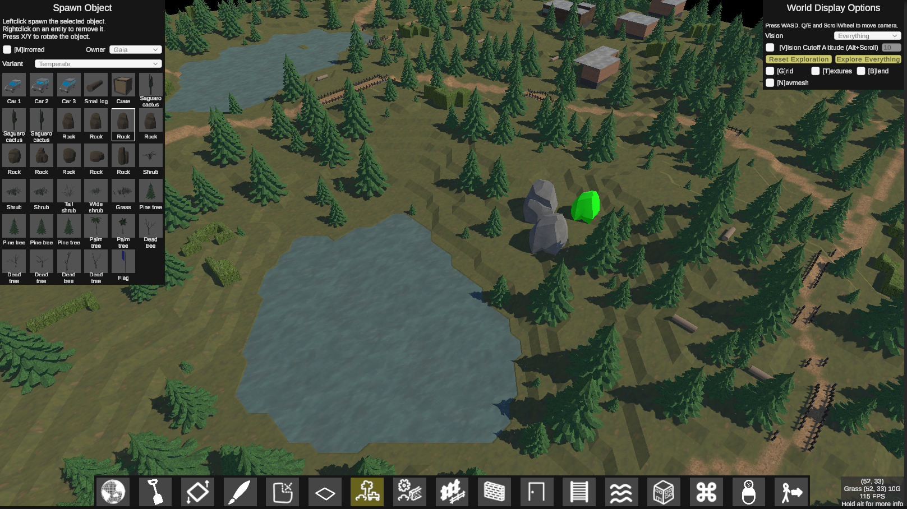

# About
BlockMaps is a Unity framework to create 3D tiled maps with underlying systems such as entity/object support, pathfinding, ray-traced vision, advanced movement (such as swimming, climbing). Everything is built in a modular way so that all interactions between the different systems should inherently work.

The project currently contains a world editor where you can play with all the systems in realtime and a game called Capture The Flag that uses the framework.

# World Editor
The world editor provides a lot of functionality to build and test own maps. Pathfinding, vision and the navmesh are all updated realtime whenever a change is made to the map.
 

*World Editor*
  

# Capture The Flag
Capture The Flag is a turn-based squad tactics game based on the classic outdoor game with the same name. It makes use of the pathfinding, vision and movement system of the BlockMaps framework and is a good showcase of what's possible with it.

The gameplay is very simple. Two teams of 8 charaters each face off on a random, unexplored map. The goal is to move a character onto the enemy flag bevor they move one on your flag. If a character gets tagged by one of the other team he is sent to jail for 5 turns and can't move. Teams consist of different characters with different attributes.

*Capture The Flag*
  

